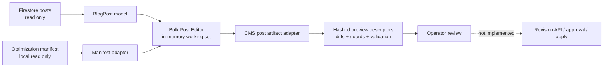

# Content Operations Bulk Editor

## Purpose

The Bulk Post Editor is the first UI slice of a broader content-operations system. It gives CMS roles a compact place to audit posts, import prepared recommendations, edit safe candidate metadata, and validate a review draft without writing to canonical Firestore post documents.

The current route is `/admin/cms/content-operations`. The navigation label is **Bulk Editor** and the page heading is **Bulk Post Editor**.

## Current Safety Boundary

This release is deliberately dry-run only.

- Firebase remains the canonical post store.
- `BlogRepositoryService.getAdminPosts$()` is used for the read projection.
- No post create, update, status, delete, backup, publish, or social-delivery method is called.
- The page has no enabled apply or publish action.
- Candidate documents live only in component memory and are discarded on navigation or reload.
- The optimization manifest is read through a local file picker and is never modified.
- Redirect-required recommendations are blocked from the metadata-only operation.
- IDs, slugs, display titles, body blocks, status, dates, canonical URLs, and media are protected.

The only candidate field paths currently allowed are:

- `seo.title`
- `seo.description`
- `categories`
- `tags`

## Data Flow

The `BlogPost` interface remains the source schema for the CMS. The artifact adapter owns serialization and parsing so future services can treat post JSON as an opaque document instead of copying the complete post schema into every API request.

## Artifact And Guard Contract

`ContentOperationPreviewItem` intentionally carries artifact descriptors rather than embedding full post documents. Each descriptor includes:

- a stable artifact ID;
- `application/json` media type;
- the CMS adapter version;
- the declared post content format;
- UTF-8 byte length;
- a SHA-256 digest of the serialized document.

The CMS-only `CmsContentOperationWorkingItem` may hold the full base and candidate `BlogPost` values while the operator is editing. This distinction keeps the local UI practical without turning full post payloads into an application-wide operation contract.

Validation compares a protected-field projection of the base and candidate documents. It also emits explicit base and candidate guard projections for post ID, slug, status, canonical URL, creation/update/publication dates, and media references. A candidate is blocked when those protected values change, when it requires an unsupported capability, or when its manifest row requires a redirect.

## Component Inventory

- `ContentOperationsPageComponent` owns loading, filters, selection, manifest import, the candidate inspector, in-memory editing, and the locked safety rail.
- `content-operations.models.ts` defines the small operation, artifact, diff, guard, validation, audit, and working-item contracts.
- `cms-post-artifact.adapter.ts` serializes and validates current post artifacts, computes diffs and SHA-256 descriptors, and enforces protected fields.
- `post-optimization-manifest.adapter.ts` parses the existing SEO manifest, rejects malformed or duplicate stable slugs, matches current posts, and creates allowlisted candidates.
- `content-operations-audit.ts` adapts the existing CMS SEO checklist into compact row-level audit data.
- `admin-navigation.config.ts` exposes the route in the Publishing group between Posts and Calendar.

## Manifest Migration Input

The existing `post-optimization-manifest.json` is supported as a migration input, not as the future API schema.

- Rows match current posts by `stableSlug` for this provisional import flow.
- Duplicate stable slugs are rejected.
- Missing post matches and unused recommendations are surfaced to the operator.
- Imported recommendations can only replace the four allowlisted metadata/taxonomy fields.
- `redirectRequired: true` stays visible but cannot be approved in this slice.

No backfill or Firestore migration is required because the feature does not persist operation state.

## Deferred Service Boundary

The following work is explicitly deferred and must be implemented before apply can be enabled:

1. An authenticated server-side content-operations API with capability authorization.
2. Immutable base and candidate artifact storage with content hashes and expiry/retention rules.
3. Durable operations, revisions, approvals, and per-item audit records.
4. Optimistic concurrency against a canonical post revision or hash, not only slug matching.
5. Idempotent apply jobs with selected-item scope, partial failure reporting, and rollback artifacts.
6. Server-side enforcement of every protected field and capability rule.
7. Redirect planning and collision checks as a separate capability.
8. Role separation for proposal, approval, and application where production policy requires it.
9. Offline queues only after the online revision/apply contract is stable.

AI services must only propose candidate artifacts. They must never receive permission to write canonical posts directly.

## Verification

Focused tests cover:

- artifact round trips and SHA-256 descriptors;
- allowlisted diffs;
- protected slug conflicts;
- redirect-required blocking;
- manifest parsing, duplicate detection, and stable-slug matching;
- preservation of canonical post fields when applying a recommendation to a candidate;
- protected route registration and the locked page-level apply state.

No Firebase deployment or production write is part of this slice.
