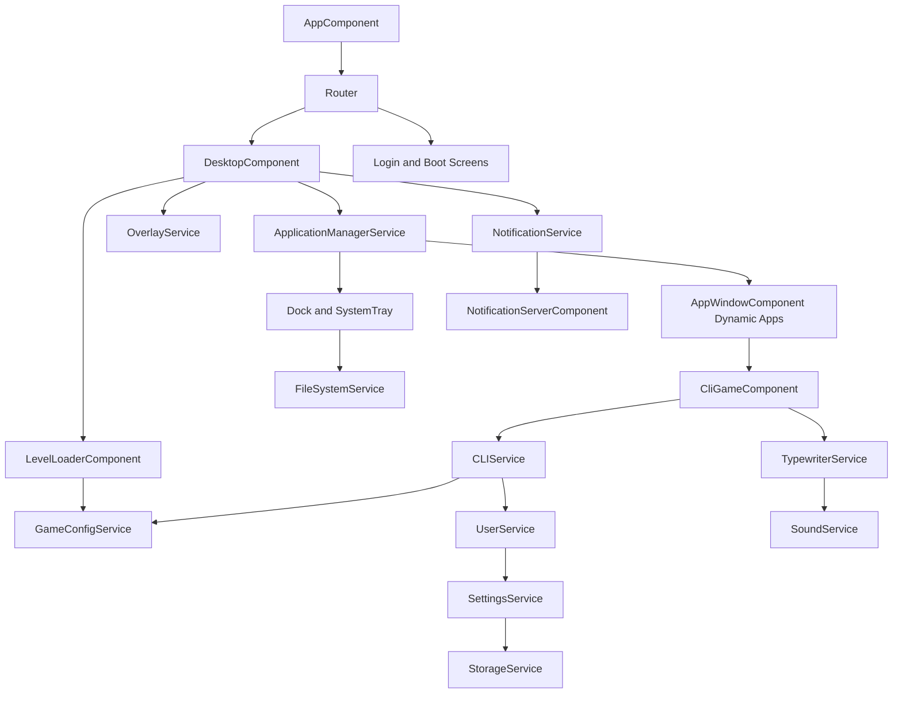

# Architecture Overview

## Runtime Shape

The app uses Angular standalone components with route-driven screens and service-centric state.

- Router controls entry screens (home, blog, admin, login, desktop, boot, sleep). The preserved Labs implementation is temporarily removed from public discovery and `/labs` redirects to `/blog` while that section is redesigned.
- `app.routes.ts` composes route groups from `features/public`, `labs`, `admin`, and `core-os`.
- `AppComponent` owns the shared site shell header for public/blog routes and intentionally excludes admin and OS desktop/login/boot/sleep/redirect routes. The compact header keeps the homepage logo, live-results search launcher, post-list shortcut, and one responsive site/account menu. Protected admin routes render their own role-aware sidebar and utility header through `AdminShellComponent`.
- Public shell utilities that are not always visible are deferred behind route, state, or viewport triggers. This includes OS notifications, reader tools, the search drawer, below-the-fold homepage sections, footer socials, and article comments/author widgets.
- Angular Router coordinates same-document View Transitions around route activation while a named route-frame snapshot limits CSS animation to the changing page content. The persistent shell remains stable, unsupported browsers navigate normally, and both system and Reader Tools reduced-motion preferences suppress the transition.
- Lazy and deferred post media uses a shared CSS view-timeline reveal class. Supporting browsers animate only opacity and transforms as media enters the viewport; unsupported and reduced-motion contexts keep images immediately visible without creating JavaScript observers.
- Blog detail pages place `BlogStickyPostToolbarComponent` in the article grid after the full post header so normal sticky positioning carries the cover thumbnail, title, compact share actions, and comments shortcut through the reading body without another scroll observer.
- Public routes use clean path URLs. Firebase Hosting rewrites app routes through `renderSeoHtml` so crawlers receive canonical, Open Graph, Twitter Card, and JSON-LD metadata in the initial HTML.
- The public startup shell includes a static inline preloader that masks the first unstyled paint until Angular, fonts, and one above-the-fold marked image are ready or capped by failsafes.
- Desktop screen coordinates window lifecycle and system UI.
- Services hold long-lived state (apps, user, settings, storage, CLI, sound, files, notifications).
- Dynamic component loading is used for in-window apps.

Current route group files are boundary markers only. They preserve existing URL paths and lazy-load legacy component locations until the folder migration moves implementations into their final homes. The 404 route uses `shared/not-found`; the old `components/not-found` compatibility path has been removed after the route graph stopped referencing it.

## Major Subsystems

- Desktop shell:
  desktop surface, tray, dock, route params, context menu.
- Window/app manager:
  app registry, app launch, focus, close, persisted open apps.
- CLI gameplay:
  command execution, typewriter output, user/level progression.
- Blog/CMS:
  public published post views, scheduled publishing through a Firebase Cloud Scheduler Function, a protected publishing Calendar with post-linked channel-specific social announcements and a durable delivery outbox, a dry-run Bulk Post Editor for reviewing hashed SEO/taxonomy candidates without canonical writes, tokenized draft previews, category/tag archives, topic hubs, blog search, read-only block rendering and SEO metadata, protected admin post list/editor, typed Editor.js-shaped block data including custom typography, stats, chart, and sanitized HTML blocks, Firestore-backed CMS storage for create/edit workflows.
- Admin console:
  protected role-aware shell with a fixed grouped sidebar, mobile drawer, compact utility header, environment/account footer, an operations dashboard sourced from current post data, and a content-operations review surface. The shell replaces page-local global navigation while preserving existing guarded URLs and feature-specific layouts. See `docs/ARCHITECTURE/CONTENT_OPERATIONS_BULK_EDITOR.md` for the dry-run artifact and safety boundary.
- Homepage CMS:
  protected `/admin/cms/homepage` controls for the public hero headline, summary, background slideshow, timing, and featured article selection through the Firestore `homepageSettings/home` document, with static fallback behavior preserved for anonymous visitors and missing config.
- Screen saver overlay:
  lightweight app-shell launcher mounted outside the route frame and toggled with unmodified `S`. It dynamically loads
  the full media viewer on first activation, backed by the same published homepage hero slides plus an IndexedDB-backed
  local image module. Its bottom studio toolbar persists module, Ken Burns, and slideshow tuning without moving media
  state into route components or Core OS. See `docs/ARCHITECTURE/SCREEN_SAVER.md`.
- Public media:
  homepage YouTube uploads are loaded through a public Firebase callable Function that keeps the YouTube Data API key server-side and returns only display-safe video metadata.
- SEO rendering:
  shared route metadata lives under `shared/seo`; repeated site identity copy is centralized in `shared/seo/site-identity.ts` for Angular and mirrored in `functions/src/seo-site.ts` for the isolated Functions build. Dynamic blog post metadata and the CMS-selected/featured/latest homepage social image are injected both client-side and server-side through the Firebase `renderSeoHtml` Function. Homepage social images receive deterministic cache versions without changing the canonical homepage identity. Unknown routes return `404` instead of homepage fallback metadata. Sitemap taxonomy output is thresholded to keep low-value category/tag pages out of the XML, while those routes remain accessible with `noindex,follow`; sitemap entries now rely on canonical URLs and `lastmod` instead of low-value `changefreq`/`priority` tags. Homepage, blog, labs, article, and topic pages include visible fallback HTML in the initial shell for crawlers and no-JS readers, and `/llms.txt` provides AI-search citation guidance. Blog feed endpoints are served by Firebase Functions at `/feed.xml` and `/feed.json`, with discovery links emitted in both Angular and server-rendered
  metadata.
- Share attribution:
  signed-in homepage and post share controls can attach provider-specific opaque IDs. Callable Functions register those IDs, keep share-point awards server-authorized, and collect separately idempotent landing telemetry without awarding points to crawler or anonymous landing requests. See `docs/ARCHITECTURE/SOCIAL_PREVIEW_AND_SHARE_ATTRIBUTION.md`.
- Shared site shell:
  a compact blog-first header, the live-results search drawer, public startup preloader coordination, stable Reader Tools, and persistent light/dark theme state live under `shared`. Theme, OS, and role-aware account actions share one responsive utility menu, while CSS token overrides remain scoped to normal site routes so OS framework screens keep their own visual system. Route changes use Angular Router-native view transitions scoped to the route frame, with persistent shell UI excluded and reduced-motion preferences honored. See `docs/ARCHITECTURE/PUBLIC_BLOG_SHELL.md`.
- Admin media library:
  protected media organizer UI for Firebase-backed uploads and metadata, with feature-scoped browsing, filtering, batch rename, resize requests, preview, and virtual folder/tag workflows.
- Labs:
  experiment components and standalone playground routes remain preserved in source, but the public Labs index is temporarily route-disabled and omitted from the header, homepage promotion, blog footer, and static search discovery.
- Persistence:
  settings/user/tasks/patches through storage strategy; CMS blog posts are read and written through the Firestore `posts` collection so public and admin views use the same current data source. Posts with `status: scheduled` and a due `publishedAt` ISO timestamp are promoted to `published` by the scheduled backend Function. Due post-linked announcements are copied into protected `socialOutbox` documents only after the article is live, leaving provider delivery to isolated connector workers. Temporary draft previews are stored as token-addressed `postPreviews` snapshots with public single-document reads and admin-only listing.
- Media/audio:
  icon/media helpers, sound playback, music and effects.
- Overlay and notifications:
  global overlays and in-app notification stream.

## High-Level Diagram

## Design Notes

- This codebase favors behavior in services over local component state.
- The primary maintainability pressure points are large services with mixed responsibilities and untyped dynamic data flows.
- Behavior stability depends heavily on preserving service public APIs while tightening internals.
