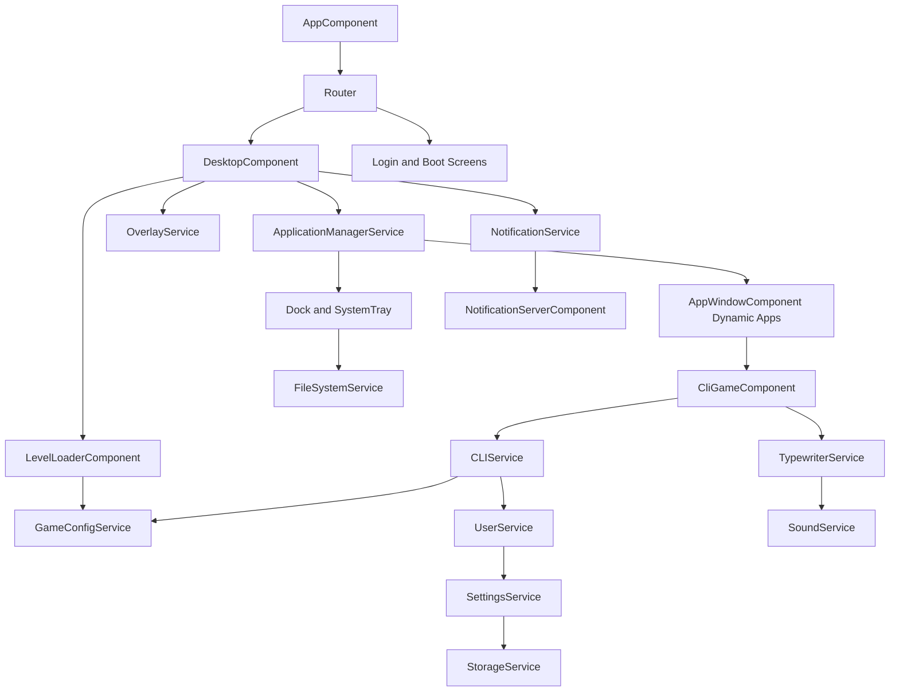

# Architecture Overview

## Runtime Shape

The app uses Angular standalone components with route-driven screens and service-centric state.

- Router controls entry screens (home, blog, labs, admin, login, desktop, boot, sleep).
- `app.routes.ts` composes route groups from `features/public`, `labs`, `admin`, and `core-os`.
- `AppComponent` owns the shared site shell header for public/blog/labs/admin routes and intentionally excludes OS desktop/login/boot/sleep/redirect routes.
- Public routes use clean path URLs. Firebase Hosting rewrites app routes through `renderSeoHtml` so crawlers receive canonical, Open Graph, Twitter Card, and JSON-LD metadata in the initial HTML.
- Desktop screen coordinates window lifecycle and system UI.
- Services hold long-lived state (apps, user, settings, storage, CLI, sound, files, notifications).
- Dynamic component loading is used for in-window apps.

Current route group files are boundary markers only. They preserve existing URL paths and lazy-load legacy component locations until the folder migration moves implementations into their final homes. The 404 route now uses `shared/not-found`, with the old component path kept as a compatibility export.

## Major Subsystems

- Desktop shell:
  desktop surface, tray, dock, route params, context menu.
- Window/app manager:
  app registry, app launch, focus, close, persisted open apps.
- CLI gameplay:
  command execution, typewriter output, user/level progression.
- Blog/CMS:
  public published post views, tokenized draft previews, category/tag archives, topic hubs, blog search, read-only block rendering and SEO metadata, protected admin post list/editor, typed Editor.js-shaped block data including custom typography, stats, chart, and sanitized HTML blocks, Firestore-backed CMS storage for create/edit workflows.
- Public media:
  homepage YouTube uploads are loaded through a public Firebase callable Function that keeps the YouTube Data API key server-side and returns only display-safe video metadata.
- SEO rendering:
  shared route metadata lives under `shared/seo`; dynamic blog post metadata is injected both client-side and server-side through the Firebase `renderSeoHtml` Function. Unknown routes return `404` instead of homepage fallback metadata. Sitemap taxonomy output is thresholded to keep low-value category/tag pages out of the XML, while those routes remain accessible with `noindex,follow`. Blog and topic pages include visible fallback HTML in the initial shell for crawlers and no-JS readers. Blog feed endpoints are served by Firebase Functions at `/feed.xml` and `/feed.json`, with discovery links emitted in both Angular and server-rendered metadata.
- Shared site shell:
  global header/menu and persistent light/dark theme state live under `shared`, with CSS token overrides scoped to normal site routes so OS framework screens keep their own visual system.
- Admin media library:
  protected media organizer UI for Firebase-backed uploads and metadata, with feature-scoped browsing, filtering, batch rename, resize requests, preview, and virtual folder/tag workflows.
- Labs:
  public experiment index with one-at-a-time embedded component demos and preserved links to standalone playground routes.
- Persistence:
  settings/user/tasks/patches through storage strategy; CMS blog posts are read and written through the Firestore `posts` collection so public and admin views use the same current data source. Temporary draft previews are stored as token-addressed `postPreviews` snapshots with public single-document reads and admin-only listing.
- Media/audio:
  icon/media helpers, sound playback, music and effects.
- Overlay and notifications:
  global overlays and in-app notification stream.

## High-Level Diagram

## Design Notes

- This codebase favors behavior in services over local component state.
- The primary maintainability pressure points are large services with mixed responsibilities and untyped dynamic data flows.
- Behavior stability depends heavily on preserving service public APIs while tightening internals.
