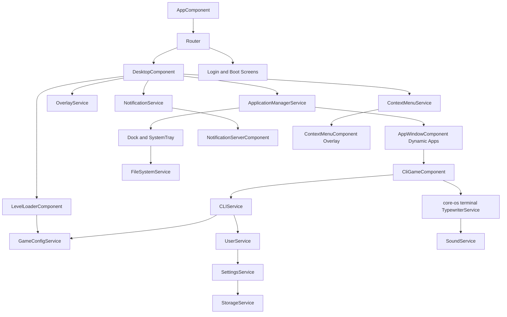

# Architecture Overview

## Physical Homepage SEO Shell

Firebase Hosting serves the built physical `index.html` for `/` before the Functions catch-all can render route-specific fallback content. The source index therefore carries the canonical homepage title/description, connected Person/WebSite/ProfilePage graph, and a compact semantic creator-promise fallback inside `<app-root>`. Angular replaces that fallback during bootstrap. With JavaScript disabled, a `noscript` rule hides the fixed initial loader so the fallback remains readable.

Dynamic SEO responses replace the existing `<app-root>` contents with the requested route fallback; routes without a fallback clear the homepage content so noindex, missing, admin, or OS responses cannot inherit it. They never append to or nest the physical homepage fallback. `scripts/validate-seo-shell.mjs` enforces the physical source, built Hosting index, and prepared Functions copy together.

## Runtime Shape

The app uses Angular standalone components with route-driven screens and service-centric state.

- Router controls entry screens (home, blog, Cat Corner, admin, login, desktop, boot, sleep). The preserved Labs implementation is temporarily removed from public discovery and `/labs` redirects to `/blog` while that section is redesigned.
- `app.routes.ts` composes route groups from `features/public`, `labs`, `admin`, and `core-os`.
- `AppComponent` owns the shared site shell header for public/blog routes and intentionally excludes admin and OS desktop/login/boot/sleep/redirect routes. The compact header keeps the homepage logo, desktop Discover/Topics/About navigation, live-results search launcher, post-list shortcut, and one responsive site/account menu. Public articles place a non-blocking anonymous reader invitation after the article body; the app-level membership component is reserved for signed-in preference completion and browser-alert follow-up, while tokenized previews remain excluded. Protected admin routes render their own role-aware sidebar and utility header through `AdminShellComponent`.
- `HomeArticleHeroComponent` keeps the physical shell’s evergreen creator promise as the one homepage H1 and exposes compact gadget, FPV, YouTube, and author paths before the CMS-selected featured story. The story title is an H2; its loading state preserves the resolved media/copy geometry, and the Daily Discovery rail remains mounted while asynchronous post and challenge data resolve so below-the-fold sections do not jump.
- Public shell utilities that are not always visible are deferred behind route, state, or viewport triggers. This includes OS notifications, reader tools, the search drawer, below-the-fold homepage sections, footer socials, and article comments/author widgets.
- Angular Router coordinates same-document View Transitions around route activation while a named route-frame snapshot limits CSS animation to the changing page content. The persistent shell remains stable, unsupported browsers navigate normally, and both system and Reader Tools reduced-motion preferences suppress the transition.
- Lazy and deferred post media uses a shared CSS view-timeline reveal class. Supporting browsers animate only opacity and transforms as media enters the viewport; unsupported and reduced-motion contexts keep images immediately visible without creating JavaScript observers.
- Blog detail pages use an editorial three-column reading grid at desktop widths: `BlogTableOfContentsComponent` owns the left rail, the article and `BlogStickyPostToolbarComponent` own the center, and `BlogPostRailComponent` reuses post blocks plus remaining related-reading suggestions on the right. An evidence surface after the excerpt shows reviewed evidence, source timing, relationships, AI/synthetic-media disclosures, and substantive updates, or an honest unclassified state for legacy posts. The shared rich-text boundary converts literal HTTP(S) source text into hardened outbound links at render time without rewriting Editor.js content, and explicit external references also populate `BlogPosting.citation` in Angular and crawler metadata. The article body is followed by one deterministically matched public topic guide when a genuine match exists, then one inline **Continue this thread** article selected only from shared canonical taxonomy or tags; the current post's primary
  canonical category outweighs several broad secondary labels, and merely recent unrelated posts remain chronological navigation rather than being mislabeled as related. The selected inline article is removed from the desktop rail, leaving up to two additional choices without duplicate links. Functions initial HTML exposes the strongest matching topic continuation through the same weighted taxonomy/tag/title/slug/excerpt intent instead of loading the entire article corpus again. Every published online article ends with a compact device-local reaction group and, when an editor marks one trusted YouTube block as the companion, an exact deferred article-to-video continuation; explicitly classified drone/FPV posts without a pairing retain the latest-feed fallback. The rails, topic and article continuations, reactions, and companion journey return to one semantic document flow below the desktop breakpoint. See `docs/ARCHITECTURE/ARTICLE_EVIDENCE_AND_DISCLOSURES.md`.
- Public routes use clean path URLs. Firebase Hosting permanently redirects the duplicate `/blog/` index URL to `/blog` before its Function rewrites, while article paths remain untouched. The local Hosting emulator is pinned to `127.0.0.1:5500` because macOS Control Center owns the default port on this workstation. Firebase Hosting rewrites the remaining app routes through `renderSeoHtml` so crawlers receive canonical, Open Graph, Twitter Card, and JSON-LD metadata in the initial HTML.
- The indexable `/editorial-standards` authority surface defines hands-on, first-person, researched, manufacturer-supplied, and synthetic-media evidence boundaries; documents sources, relationships, AI assistance, high-stakes limits, and substantive corrections; and reuses the existing contact/privacy paths. Angular, the Functions fallback, sitemap, internal search, `llms.txt`, author surfaces, and homepage/article footers expose one matching policy without mutating posts or author records. See `docs/ARCHITECTURE/EDITORIAL_STANDARDS_AND_CORRECTIONS.md`.
- The indexable `/resources/personal-aircraft-buyer-verification` surface turns the personal-aircraft printable into a substantive source-backed guide. Angular and Functions render the same canonical identity, non-advisory evidence boundary, official starting points, internal continuations, and PDF path; the sitemap, site search, `llms.txt`, Drones & FPV hub, and prepared article packages expose the guide without a Firestore migration.
- The indexable `/resources/gadget-usefulness-scorecard` surface gives **Is It Actually Useful?** one repeatable site-and-channel framework. Its one-page printable scores problem fit, evidence, true cost, everyday friction, and support; Angular and Functions share the canonical guide, cautions, internal continuations, PDF path, sitemap/search/`llms.txt` discovery, and bounded `resource_page` measurement without a Firestore migration.
- The public startup shell includes a static inline preloader that masks the first unstyled paint until Angular, fonts, and one above-the-fold marked image are ready or capped by failsafes.
- Desktop screen coordinates window lifecycle and system UI.
- Services hold long-lived state (apps, user, settings, storage, CLI, sound, files, notifications).
- Dynamic component loading is used for in-window apps.

Current route group files are boundary markers only. They preserve existing URL paths and lazy-load legacy component locations until the folder migration moves implementations into their final homes. The 404 route uses `shared/not-found`; the old `components/not-found` compatibility path has been removed after the route graph stopped referencing it.

## Major Subsystems

- Desktop shell:
  legacy desktop surface and route/context-menu orchestration with canonical `core-os/dock` and `core-os/tray` chrome.
- Window/app manager:
  app registry, app launch, focus, close, persisted open apps.
- CLI gameplay:
  legacy command execution and user/level progression with renderer-agnostic typed output owned by `core-os/terminal`.
- Blog/CMS:
  public published post views, optional typed article evidence/disclosure metadata, a reader-membership campaign that reuses authentication, comments, points, Profile preferences, and Web Push, scheduled publishing through a Firebase Cloud Scheduler Function, a URL-backed Post/Social Shares/Preview editor workspace with explicit-apply AI social variants, a protected publishing Calendar that reuses the controlled native-first composer for post-linked channel announcements, and a durable delivery outbox, a dry-run Bulk Post Editor for reviewing hashed SEO/taxonomy candidates without canonical writes, tokenized draft previews, category/tag archives, image-led topic hubs, blog search, read-only block rendering and SEO metadata, a protected admin post list/editor with a read-only evidence-review queue and individual review workflow, typed Editor.js-shaped block data including custom typography, stats, chart, polls, Suno songs, and sanitized HTML blocks, Firestore-backed CMS storage for
  create/edit workflows. Poll votes use authenticated callable Functions and a backend-only aggregate/vote hierarchy with server-enforced result visibility; see `docs/ARCHITECTURE/EDITORJS_POLLS.md`. Suno songs use a dedicated URL-normalizing authoring tool and provider-specific sandboxed public player without an external API; see `docs/ARCHITECTURE/EDITORJS_SUNO_EMBEDS.md`. Public post discovery uses one repository-free listing component with list, grid, fan, compact, and homepage editorial variants; topic pages place featured/recent writing before the preserved supporting guide. See `docs/ARCHITECTURE/ARTICLE_EVIDENCE_AND_DISCLOSURES.md`, `docs/ARCHITECTURE/TOPIC_PAGES_AND_POST_LISTING.md`, and `docs/ARCHITECTURE/READER_MEMBERSHIP_CAMPAIGN.md`.
- Cat Corner:
  a soft-gated `/cat-corner` editorial hub that reuses the public Blog/Editor.js post model while adding optional discovery metadata, a reusable Gretchen unlock block, the non-administrative `catCornerAddict` custom claim, an immediate profile badge, and a role-aware site-menu entry. Non-discovery Cat posts stay directly readable but are omitted from normal public discovery and marked `noindex,nofollow`; see `docs/ARCHITECTURE/CAT_CORNER.md`.
- Admin console:
  protected role-aware shell with a fixed grouped sidebar, mobile drawer, compact utility header, environment/account footer, an operations dashboard sourced from current post data, a content-operations review surface, and a searchable role-filtered operating guide with direct workflow links. The shell replaces page-local global navigation while preserving existing guarded URLs and feature-specific layouts. See `docs/ARCHITECTURE/ADMIN_GUIDE.md` for the guide content and permission projection contract, and `docs/ARCHITECTURE/CONTENT_OPERATIONS_BULK_EDITOR.md` for the dry-run artifact and safety boundary.
- Homepage CMS:
  protected `/admin/cms/homepage` controls featured-article selection and whether its dedicated text-free editorial image or cover is preferred through the existing Firestore `homepageSettings/home` document. The public creator-promise H1 and discovery path are deliberately not CMS-rotated; the selected article occupies the stable H2 story frame. Legacy copy, slide, and timing data remains stored for the optional Screen Saver and rollback, while the public homepage uses one stable article frame and a static image fallback. See `docs/ARCHITECTURE/HOMEPAGE_HERO_CMS.md`.
- Daily Discovery:
  a guest-accessible set of up to ten daily homepage title-gap questions, attached to the hero as an inline rail and routed through the existing header search. The first request each Eastern date deterministically materializes one private set from published post titles without an AI provider or scheduled job. Public callable Functions keep accepted answers private, while authenticated correct answers receive an idempotent five-point award per challenge plus once-per-day streak progress; guest completion remains device-local. See `docs/ARCHITECTURE/DAILY_DISCOVERY.md`.
- Screen saver overlay:
  lightweight app-shell launcher mounted outside the route frame and toggled with unmodified `S`. It dynamically loads
  the full media viewer on first activation, backed by the same published homepage hero slides plus an IndexedDB-backed
  local image module. Its bottom studio toolbar persists module, Ken Burns, and slideshow tuning without moving media
  state into route components or Core OS. See `docs/ARCHITECTURE/SCREEN_SAVER.md`.
- Public media:
  general homepage and blog uploads are loaded from the Colin Michaels channel through a public Firebase callable Function that keeps the YouTube Data API key server-side and returns only display-safe video metadata. Explicit drone/FPV surfaces select Captain Colin instead. The configured selected-channel parameter, YouTube API response, callable payload, public channel/subscription links, and channel analytics must all resolve to the matching canonical channel; Functions and Angular fail closed instead of presenting another channel under that identity. The public section exposes distinct view-channel and subscribe actions and records bounded video/channel selections through the existing privacy-aware analytics boundary without accessing a visitor's YouTube account.
- SEO rendering:
  shared route metadata lives under `shared/seo`; repeated site identity copy is centralized in `shared/seo/site-identity.ts` for Angular and mirrored in `functions/src/seo-site.ts` for the isolated Functions build. Dynamic blog post metadata and the CMS-selected/featured/latest homepage social image are injected both client-side and server-side through the Firebase `renderSeoHtml` Function. Homepage social images receive deterministic cache versions without changing the canonical homepage identity. Unknown routes return `404` instead of homepage fallback metadata, and the Angular wildcard route reapplies page-not-found `noindex,follow` metadata so hydration cannot leave an indexable page title or robots value behind. Sitemap taxonomy output is thresholded to keep low-value category/tag pages out of the XML, while those routes remain accessible with `noindex,follow`; sitemap entries now rely on canonical URLs and `lastmod` instead of low-value `changefreq`/`priority` tags. Homepage,
  blog, labs, article, and topic pages include visible fallback HTML in the initial shell for crawlers and no-JS readers, and `/llms.txt` provides a proposal-conformant, curated index for AI agents without replacing canonical HTML, crawler policy, the sitemap, or feeds. Blog feed endpoints are served by Firebase Functions at `/feed.xml` and `/feed.json`; relative stored canonicals are resolved to absolute HTTP(S) item URLs with post-route fallback. All four crawler-facing Functions apply the same report-only security-header policy as Hosting before success or error routing, with a contract that detects configuration drift. Feed discovery links are emitted in both Angular and server-rendered
  metadata. Public blog taxonomy uses mirrored Angular/Functions alias contracts: legacy Cat Corner, health, recovery, and overlapping Recovery/Personal Growth tag archives resolve to one canonical category identity without rewriting stored posts; exact Hosting redirects remove the duplicate public URLs.
- Share attribution:
  signed-in homepage and post share controls can attach provider-specific opaque IDs. Callable Functions register those IDs, keep share-point awards server-authorized, and collect separately idempotent landing telemetry without awarding points to crawler or anonymous landing requests. See `docs/ARCHITECTURE/SOCIAL_PREVIEW_AND_SHARE_ATTRIBUTION.md`.
- Public analytics:
  the application shell loads one production GA4 destination directly, while a shared service owns query-free Angular page views and privacy-filtered reader events for article depth, completion, saves, reactions, poll votes, shares, comments, search, internal and YouTube content selection, and Daily Discovery. It excludes local and Admin activity, keeps content/account text out of telemetry, and leaves Firebase callables and YouTube Studio authoritative. See `docs/ARCHITECTURE/ANALYTICS_AND_MEASUREMENT.md`.
- Shared site shell:
  a compact blog-first header, the live-results search drawer, public startup preloader coordination, stable Reader Tools, and persistent light/dark theme state live under `shared`. Theme, OS, and role-aware account actions share one responsive utility menu, while CSS token overrides remain scoped to normal site routes so OS framework screens keep their own visual system. The homepage information footer owns primary navigation, copyright, privacy, and contact discovery while the fixed social bar stays social-only; see `docs/ARCHITECTURE/PRIVACY_POLICY_AND_PUBLIC_FOOTER.md`. Route changes use Angular Router-native view transitions scoped to the route frame, with persistent shell UI excluded and reduced-motion preferences honored. See `docs/ARCHITECTURE/PUBLIC_BLOG_SHELL.md`.
- Admin media library:
  protected media organizer UI for Firebase-backed uploads and metadata, with feature-scoped browsing, filtering, batch rename, resize requests, preview, and virtual folder/tag workflows.
- Labs:
  experiment components and standalone playground routes remain preserved in source, but the public Labs index is temporarily route-disabled and omitted from the header, homepage promotion, blog footer, and static search discovery.
- Persistence:
  settings/user/tasks/patches through storage strategy; CMS blog posts are read and written through the Firestore `posts` collection so public and admin views use the same current data source. Legacy email and newsletter choices remain preserved as historical data on `users/{uid}.communicationPreferences`, but no public control promises email delivery until a delivery system exists. A future email system must collect fresh explicit consent rather than treating those legacy values as a mailing list. Browser subscriptions remain per device behind the existing push registration Functions. Social drafts share the post save/backup boundary and may omit `scheduledAt` only while their lifecycle state remains `draft`; unscheduled drafts never appear on Calendar timelines or enter delivery parsing. Posts with `status: scheduled` and a due `publishedAt` ISO timestamp are promoted to `published` by the scheduled backend Function. Due post-linked announcements are copied into protected `socialOutbox` documents only after the article is live, leaving provider delivery to isolated connector workers. Temporary draft previews are stored as token-addressed `postPreviews` snapshots with public single-document reads and admin-only listing.
- Media/audio:
  icon/media helpers, sound playback, music and effects.
- Overlay and notifications:
  global overlays and in-app notification stream.

## High-Level Diagram

## Design Notes

- This codebase favors behavior in services over local component state.
- The primary maintainability pressure points are large services with mixed responsibilities and untyped dynamic data flows.
- Behavior stability depends heavily on preserving service public APIs while tightening internals.
