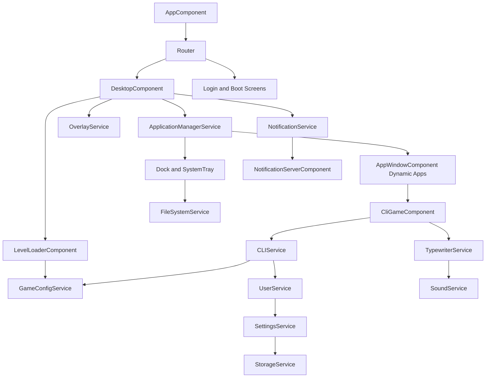

# Architecture Overview

## Runtime Shape

The app uses Angular standalone components with route-driven screens and service-centric state.

- Router controls entry screens (home, blog, admin, login, desktop, boot, sleep).
- `app.routes.ts` composes route groups from `features/public`, `labs`, `admin`, and `core-os`.
- Desktop screen coordinates window lifecycle and system UI.
- Services hold long-lived state (apps, user, settings, storage, CLI, sound, files, notifications).
- Dynamic component loading is used for in-window apps.

Current route group files are boundary markers only. They preserve existing URL paths and lazy-load legacy component locations until the folder migration moves implementations into their final homes. The 404 route now uses `shared/not-found`, with the old component path kept as a compatibility export.

## Major Subsystems

- Desktop shell:
  desktop surface, tray, dock, route params, context menu.
- Window/app manager:
  app registry, app launch, focus, close, persisted open apps.
- CLI gameplay:
  command execution, typewriter output, user/level progression.
- Blog/CMS:
  public published post views, read-only block rendering and SEO metadata, protected admin post list/editor, typed Editor.js-shaped block data.
- Persistence:
  settings/user/tasks/patches through storage strategy.
- Media/audio:
  icon/media helpers, sound playback, music and effects.
- Overlay and notifications:
  global overlays and in-app notification stream.

## High-Level Diagram

## Design Notes

- This codebase favors behavior in services over local component state.
- The primary maintainability pressure points are large services with mixed responsibilities and untyped dynamic data flows.
- Behavior stability depends heavily on preserving service public APIs while tightening internals.
