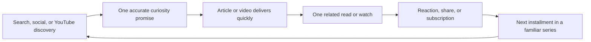

# Creator Growth Operating System

## Objective

Build a recognizable Colin Michaels creator brand that earns discovery, holds attention, and gives people a reason to return across ColinMichaels.com and Captain Colin on YouTube.

The north star is a growing **monthly engaged audience**: people who read, watch, react, share, subscribe, and return. Raw page views and subscriber totals remain supporting measures because neither proves attention or loyalty on its own.

## Evidence Snapshot

Captured August 14, 2026 from the production GA4 property, its linked Search Console reports, and Captain Colin YouTube Studio. These are directional, time-bound baselines rather than promises of future performance.

### ColinMichaels.com

Search Console, July 17 through August 13:

- `472` Google impressions and `5` clicks: `1.06%` click-through rate at average position `18.57`.
- The homepage earned `68` impressions at average position `6.1` but no clicks. The old **Projects, Writing, Media & Recovery Updates** title was visible without a clear reader promise.
- The full-size Temu drone article earned `105` impressions, one click, and average position `9.9`. It is the clearest current bridge between unusual internet finds, gadgets, and Colin's established drone identity.
- Drone-related visible queries contributed `36` impressions. **temu full size drone** supplied `19` at average position `9.21`.

GA4, most recent seven-day homepage snapshot:

- `57` active users, `84` sessions, `111` views, and `249` events.
- Sessions were led by Organic Social (`37`), Direct (`22`), Organic Search (`11`), and Organic Video (`8`).
- The Temu drone story was the strongest visible non-homepage article with `14` views.

GA4 live 28-day recheck, July 18 through August 14, read August 15:

- `429` active users, `414` new users, `36 seconds` average engagement time per active user, and `1.9K` events.
- The Temu drone article led the visible page table with `159` views, `142` active users, `544` events, and a `56.6%` bounce rate.
- The homepage followed with `138` views, `57` active users, `370` events, and a `58.7%` bounce rate.
- Visible session-source leaders included Direct (`148`), Facebook referrals (`90` plus `74` mobile), ChatGPT (`52`), YouTube (`39`), Bing organic (`34`), and Google organic (`34`).
- The seven-day property card still showed `0` key events. The application has local interaction instrumentation, but production event receipt and GA4 key-event configuration remain separate release gates.

### Captain Colin on YouTube

YouTube Studio, July 17 through August 13:

- `129` channel views, `2.5` watch hours, and net `-1` subscriber.
- `85` monthly viewers: `87.1%` new, `10.6%` casual, and `2.4%` regular.
- `85.4%` of watch time came from viewers who were not subscribed.
- Video content received `763` impressions, a `7.3%` click-through rate, and `1:10` average view duration.
- Discovery came primarily from YouTube Search (`37.6%`), Direct or unknown (`24.8%`), Browse (`14.4%`), and External (`12.8%`).

Channel-identity recheck on August 15:

- The signed-in Studio default opened a different **Colin Michaels** channel (`UCCJMwxuUIb6S4aoZiZeAVeQ`) with `8` subscribers, `47` views, and `0.6` watch hours in the last 28 days.
- ColinMichaels.com and the growth packages continue to designate the established **Captain Colin** channel (`UCKZ3E88t-BoUqPgZygJw6bA`), whose captured public baseline was `602` subscribers, `394` videos, and `124,185` views.
- Do not split new releases, redirects, or reciprocal links across both identities. Confirm the intended primary channel and exact Studio channel ID before any live YouTube mutation; the current evidence favors consolidating on Captain Colin's existing audience and archive.

## Strategic Decision

Lead the public promise with **cool gadgets, useful technology, internet finds, and FPV stories**. These subjects give the brand one recognizable curiosity-and-utility lane while preserving recovery writing, software architecture, and Labs as authentic secondary collections.

Editorial mix:

- `60%` unusual, useful, or strange gadgets and internet discoveries.
- `25%` practical technology, buying guides, and one-problem/one-fix explainers.
- `15%` tangible consumer-facing AI tied to devices, creator work, or everyday usefulness.

Every candidate should pass this gate: **Would someone who clicked the full-size Temu drone story want this even if they did not already follow AI or software development?**

## Audience Loop

The website and channel should exchange audiences deliberately:

- Each flagship article gets a companion video when the subject benefits from motion, demonstration, place, or personality.
- Each companion video links to one canonical article for sources, details, photos, or updates.
- Article endings promote one relevant next article and, when available, one relevant Captain Colin video.
- Videos use playlists, end screens, and a spoken next-watch cue rather than a generic subscribe request alone.

## Repeatable Series

### Is It Actually Useful?

Unusual gadgets, marketplace finds, retro-tech revivals, and clever problem-solvers. State clearly whether an item is owned, tried, borrowed, or research-only, then score problem fit, evidence, true cost, everyday friction, and support before explaining who it helps and who should skip it.

### Captain Colin Flies

FPV flights, Florida places, unusual locations, and the practical story behind getting the shot. Searchable location and aircraft terms support discovery; Colin's commentary and recurring format build familiarity.

### One Annoying Problem, One Useful Fix

Compact practical-tech stories that solve one specific frustration. These can become an article, a standard video, and a short demonstration without stretching one idea into filler.

## Publishing Cadence

Use a sustainable rolling ten-day production cycle:

1. Publish one flagship article with useful original framing, two contextual images, sources, and a direct verdict.
2. Publish one companion standard video when there is real footage, a demonstration, or a strong first-person angle.
3. Cut up to two Shorts only when each has its own complete hook and payoff.
4. Post one community question tied to the next decision, not a generic engagement prompt.
5. Review packaging and retention before choosing the next installment.

Quality remains the gate. A weak daily upload is not preferable to a recognizable, useful weekly or ten-day release.

## First Release

This repository release establishes the conversion and identity foundation:

- Replaces the vague homepage search title with **Cool Gadgets, Useful Tech & Internet Finds | Colin Michaels**.
- Rewrites the homepage and blog descriptions around the current curiosity-and-utility promise while retaining FPV, recovery, and creator projects.
- Connects the Person entity to the canonical YouTube channel and Instagram profile in structured data.
- Replaces the unavailable `@captaincolinfpv` Instagram destination with the verified active `@colinmichaels` profile across Angular author surfaces, the physical homepage, Functions structured data, and the fixed social bar. The social bar now uses crawlable, keyboard-accessible HTTPS links from one canonical profile contract and records only a bounded platform code when a visitor selects one.
- Recasts the homepage YouTube section around the actual Captain Colin channel subjects.
- Adds explicit **View channel** and **Subscribe on YouTube** actions.
- Measures video, channel, and subscription choices with the existing privacy-aware `select_content` event, `source_component=homepage_youtube`, and a bounded action code. No title, description, viewer identity, or account data is sent.
- Adds an indexable **Drones & FPV** hub that joins matching articles, an original Florida-flight hero, the latest Captain Colin videos, an explicit subscribe path, and topic-specific `source_component=topic_drones_youtube` measurement without requiring a Firestore migration.
- Continues eligible drone/FPV articles into the latest Captain Colin videos with a deferred, contextual panel and `source_component=article_drones_youtube`; explicit topic/taxonomy matching prevents generic promotion on unrelated stories.
- Lets an editor designate one trusted YouTube block as an article's exact companion, giving that pairing priority over the latest-feed fallback and measuring it independently as `source_component=article_companion_youtube` without migrating existing posts.
- Gives a finished reader one compact **Continue this thread** article before the optional account invitation. The primary canonical category dominates broad secondary labels and tags, no unrelated recent post is called related, the chosen article is removed from the desktop rail, and selections reuse the privacy-bounded `related_reading` event. Functions initial HTML also exposes the strongest matching topic continuation without an extra full-corpus read. This automatic continuation does not replace an editor adding a genuinely contextual in-body link.
- Expands the protected pre-publication review into a **Discovery & Trust Checklist** that surfaces usable references, contextual in-body next reads, and evidence-ready artifacts without blocking legitimate first-person journals, claiming media is original, or rewriting stored posts.
- Adds a public **Editorial Standards & Corrections** authority page that tells readers and crawlers exactly what hands-on, first-person, research-only, manufacturer-supplied, and synthetic-media labels mean; documents sourcing, relationships, AI assistance, high-stakes limits, and correction handling; aligns crawler HTML, structured data, sitemap, internal search, author identity, footers, and `llms.txt`; and reuses the existing contact/privacy boundary without claiming legacy compliance or fictional credentials.
- Adds an optional per-article evidence and disclosure contract that exposes reviewed evidence, source timing, relationships, AI/synthetic-media assistance, substantive updates, and explicit external `BlogPosting.citation` URLs to readers and crawlers; legacy articles show **Not yet classified** until reviewed individually, and no content is bulk-labeled or rewritten.
- Adds a separate read-only **Discovery & trust review queue** to protected Posts so the legacy corpus can be worked systematically. It combines evidence completeness with usable-source, contextual-next-read, and supporting-artifact signals; prioritizes published required evidence/source work; leaves continuations and artifacts advisory; and routes every decision through the individual editor without changing Firestore or bulk-inferring claims.
- Applies that contract to six content packages: five source-led packages—HOVERAir AQUA, passenger drones, Unitree R1, the Laundry Chair, and the exact-ID Temu refresh—plus the mixed-evidence Farmers Paradise first-party video companion. The repository gate checks evidence basis, article-specific boundaries, source dates, relationships, AI/synthetic-media disclosure, explicit non-media references, and published-update notes without importing or publishing them.
- Supplies a complete staged **Is It Actually Useful?** HOVERAir AQUA package with sourced copy, five distinct article visuals, a companion YouTube script, and a dedicated thumbnail. A live preflight later found the same topic already published under `/blog/hoverair-aqua-waterproof-drone-clever-or-1299-overkill`; the staged package is therefore consolidation-only and must be merged into that stable record or retired, never published under a second canonical.
- Supplies the second **Is It Actually Useful?** draft: a current purchase-evidence check for Jetson ONE, Pivotal Helix, and RYSE RECON; a plain-language Part 103 boundary; canonical CMS import; five distinct article visuals; and a dedicated companion-video thumbnail and script. It turns the strongest live full-size-drone curiosity signal into a useful follow-up while remaining local and unpublished until editorial review.
- Supplies the third **Is It Actually Useful?** draft: a current Unitree R1 tier check that distinguishes the $4,900 Air headline from the $5,900 R1 and quote-only developer-focused EDU configuration; preserves the manufacturer safety boundary; and provides validated CMS JSON, six original editorial assets, and a companion-video package. It expands the curiosity lane into tangible robotics without returning to generic AI coverage and remains local and unpublished until editorial review.
- Supplies the fourth practical-curiosity draft across **One Annoying Problem, One Useful Fix** and **Is It Actually Useful?**: a current $1,100 Simone Giertz Laundry Chair preorder check that explains the rotating-rail idea, compares simpler wear-again zones, preserves the no-hands-on and estimated-shipping boundaries, and provides validated CMS JSON, six original editorial assets, a six-minute companion script, Shorts, community prompt, end screen, and count-aware measurement plan. It broadens the runway beyond drones and robots while remaining local and unpublished until editorial and rights review.
- Audits the existing Temu mega-drone article as the first high-impression/low-CTR optimization target and prepares a stable-ID refresh with stronger title/description packaging, an explicit research disclosure, clearer proof and Part 103 boundaries, a contextual Drones & FPV link, two disclosed inline illustrations, expanded interaction, verified image metadata, and a complete Captain Colin companion-video package with a dedicated commentary-labeled thumbnail. The current Goonzquad block remains third-party evidence; an exact `isCompanionVideo` pairing is gated until a real Captain Colin upload exists. The package remains local; because it targets a published production ID, it requires a fresh production recheck and explicit editorial approval before import.
- Promotes that stable-ID Temu refresh to `featured: true` after the live 28-day GA4 table showed it leading the site with `159` views and `142` active users. The existing homepage policy can therefore lead with demonstrated interest after review and import without hard-coding a permanent popularity claim.
- Adds a crawlable `/resources/personal-aircraft-buyer-verification` authority page around the visually verified two-page **Personal Aircraft Buyer Verification** worksheet. The guide supplies more than 600 words of unique buyer-verification context, current official eCFR/FAA/NTSB/FTC starting points, an explicit non-advisory boundary, related article/topic paths, Angular/Functions metadata parity, sitemap/search/`llms.txt` discovery, and a bounded `resource_page` download event; both relevant content packages and the Drones & FPV hub now link the guide instead of dropping readers directly into a PDF.
- Turns **Is It Actually Useful?** into a reusable public framework with a visually verified one-page **Gadget Usefulness Scorecard** and a substantive `/resources/gadget-usefulness-scorecard` guide. The Gadgets & Toys hub, Angular/Functions crawler identity, sitemap, search, `llms.txt`, privacy-bounded `resource_page` measurement, HOVERAir AQUA, Unitree R1, Laundry Chair, and their staged Captain Colin descriptions now share one problem-fit, evidence, true-cost, everyday-friction, support, and verdict loop without claiming the score is scientific product testing or buying advice.
- Builds the second exact-page authority cohort around that framework: 25 current gadget, camera, filmmaking, maker, regional-tech, and publication routes. Eight can enter personalized preparation only after the public guide/PDF gate, seven require a real experience or relationship decision, ten remain on evidence/fit/commercial holds, and zero have been contacted. A shared validator protects both the 25-page FPV cohort and this cohort from duplicate targets, unsafe routes, stale totals, prohibited tactics, or an unapproved contacted state.
- Audits the August 13 **Farmers Paradise** upload against its actual `2:38` public-video sequence and prepares an accurate farm-tour title, chaptered description, disclosed thumbnail composite, control-versus-challenger test, focused flight playlist, end screen, audience question, and count-aware `24-hour`/`7-day`/`14-day` measurement plan. It also supplies the first complete **Captain Colin Flies** companion article: validated draft CMS JSON, an exact editor-selected YouTube pairing, five documentary frame stills, a field-notes path, official FAA context, a reader poll, and staged reciprocal description/comment copy that cannot activate until the article is publicly verified. Both packages remain local and make no CMS, YouTube, or production-site changes.
- Captures the live Captain Colin public identity, 602-subscriber/394-video/124,185-view snapshot, current About copy, plain-HTTP website link, `pvXak3YGEjk` trailer, and six Home rows; prepares one coherent channel-level refresh with exact evidence-led About copy, HTTPS profile continuations, a safe-area-checked banner, a 58-second original-footage trailer, returning-viewer spotlight, promise-led Home order, gated series playlists, and staged measurement/rollback. The package preserves every existing video and remains local until explicit channel-operator review.
- Converts the channel's `14,920`-view Hurricane Milton outlier into an accurate evergreen gateway without rewriting its proven title or replacing its video ID. The local package corrects “tornados firsthand” to an emergency tornado warning, adds transcript-grounded chapters and official safety starting points, requires a real-frame replacement for the criticized synthetic thumbnail, continues viewers to Farmers Paradise and the Drones & FPV hub, and keeps all comment care manual. No YouTube surface has been changed.
- Scores four proven archive candidates on discovery, current-promise fit, first-party evidence, evergreen utility, continuation, audience conversation, and risk control rather than choosing the largest view count. The `2,328`-view Insta360 Ace Pro FPV upload wins `46/50` because its complete transcript and recurring audience questions support a useful hands-on field-test gateway. Its local package separates documented modes from unknown settings, stages description/chapters before title or thumbnail tests, continues viewers to the related BetaFPV flight and the Gadget Usefulness Scorecard, requires real source frames, and leaves every YouTube surface unchanged until operator approval.
- Completes the reciprocal site destination for that Ace Pro gateway: a validated mixed-evidence CMS draft with one exact companion embed, three first-party in-body frames, separate cover/card/social crops, transcript-grounded test moments, an explicit unknown-settings table, a save-worthy eight-step retest checklist, current manufacturer and FAA starting points, and a four-choice reader poll. A repeatable read-only production preflight proves the proposed route remains an unpublished `404`, the published slug and sitemap do not contain it, and the exact `OFeCTH2LP9s` upload still resolves under Captain Colin; anonymous direct-document denial keeps private-draft reservation in the protected importer. The staged YouTube description names the canonical article but cannot expose it until editorial approval, authenticated preview, public `200` verification, and matching production metadata are complete.
- Completes the closest-next-watch half of that archive loop with a separate BetaFPV 95X V3 article and YouTube draft. Colin's own visible replies preserve ISO 100, automatic settings, Log/DaVinci, 450mAh 4S, windy 2.5-3-minute, and VelociDrone practice context; the package makes the missing build, camera, raw-file, route, voltage, and controlled-test evidence equally visible, adds a nine-step retest and current official starting points, uses clearly disclosed editorial illustrations only on the article, and refuses invented chapters or a synthetic YouTube thumbnail. Every CMS and channel action remains gated and independently measurable.
- Converts the eight evidence-ready article packages into a machine-validated release runway instead of expanding the unpublished backlog. A seven-factor, 50-point score makes the Ace Pro first-party article the strongest new flagship at `47/50`, while the operational sequence repairs the proven Temu search/CTR leak first, launches the exact Ace Pro article/video loop second, and tests the non-drone Laundry Chair package third. The runway records the live HOVERAir canonical conflict and forbids a duplicate publication. Every score has a written evidence reason; every sequencing exception has a release reason and activation gate; all CMS, deployment, channel, outreach, commit, and push actions remain false.
- Converts the anonymous reader account pitch from a 3.2-second focus-trapped mobile interruption into an after-article inline invitation with account, sign-in, and Not now choices visible together.
- Locks the crawlable identity and matching intent of code-defined public topics so a stale Firestore rename cannot change a valid route into a client canonical that returns a server `404`.
- Gives the physical homepage and Functions-rendered archive/static routes meaningful initial HTML, linked articles, and route-appropriate structured data.
- Gives the hydrated homepage the same stable creator-promise H1, a compact gadget/FPV/YouTube/About discovery path, an H2 featured story, and loading geometry that reduced local mobile CLS from the audited `0.189` baseline to `0.0031`.
- Records the complete 130-URL technical/content/SXO baseline and staged remediation in `docs/SEO/AUDITS/2026-08-15/`.

## 30/60/90-Day Execution

### Days 1-30: Promise and measurement

- Deploy the identity and YouTube conversion release.
- Verify the new search title, description, Person `sameAs`, and YouTube events in production.
- Give Google time to recrawl before judging homepage CTR.
- Follow the validated runway: refresh the existing Temu page, publish the Ace Pro first-party article/video loop, then test the Laundry Chair package after its volatile preorder facts are rechecked. Consolidate or retire the staged HOVERAir draft after exact-record comparison; never create a second public HOVERAir AQUA article.
- Link each article/video pair in both directions.

### Days 31-60: Double down on demonstrated demand

- Expand the best-performing query/topic into a three-piece cluster: main story, practical follow-up, and comparison or update.
- Repackage low-CTR, above-average-impression pages without changing URLs.
- Use video retention spikes and dips to move the strongest moment earlier in the next edit.
- Add end screens and playlists that continue the same audience promise.

### Days 61-90: Build loyalty and authority

- Continue the two strongest repeatable series and pause subjects that repeatedly fail to earn qualified attention.
- After the public asset gate and explicit authorization, prepare only the ready rows from the validated gadget, FPV, Florida, and practical-tech cohorts; relationship-gated work must represent a genuine collaboration, class, talk, exhibit, or reported contribution.
- Turn original field notes, footage, comparison tables, or checklists into citation-worthy assets.
- Review new, casual, and regular viewer movement; do not use subscriber count alone as the loyalty verdict.

## 90-Day Targets

Targets are thresholds for decision-making, not guaranteed outcomes:

| Metric | Baseline | 90-day target |
| --- | ---: | ---: |
| Google organic clicks, comparable 28 days | 5 | 15 or more |
| Homepage Google CTR | 0% on 68 impressions | 2% or better after at least 100 new impressions |
| Temu drone article Google CTR | 0.95% | 2% or better without losing first-page position |
| YouTube monthly audience | 85 | 125 or more |
| YouTube casual-viewer share | 10.6% | 15% or better |
| YouTube net subscribers | -1 | Positive for two consecutive 28-day periods |
| YouTube content CTR | 7.3% | Hold above 5% while increasing impressions |
| Site-to-YouTube selections | Not measured | Establish a clean 28-day baseline, then improve it by 20% |

Compare average view duration and retention only among videos of similar format and length. A shorter video can raise duration percentage without creating more satisfaction or watch time.

## Review Scorecard

Review every ten days and every 28 days:

- Discovery: impressions, search position, traffic source, and new viewers.
- Packaging: Google CTR and YouTube Home/Suggested/Subscriptions CTR.
- Delivery: article 25%/95% progress, video first-30-second retention, average view duration, and top dips/spikes.
- Loyalty: related-content selections, returning/casual/regular viewers, comments, reactions, saves, shares, and net subscribers.
- Cross-channel: YouTube referral sessions to the site plus `homepage_youtube`, `topic_drones_youtube`, `article_drones_youtube`, and `article_companion_youtube` selections from the site.

Do not interpret low-volume percentage changes without the underlying counts. Do not treat a page load, impression, or subscriber as proof that a person read, watched, or liked the work.

## Deployment and Rollback

- Deploy Angular Hosting for the public copy, metadata, structured data, and interaction tracking.
- Run `npm run prepare:functions-seo` after the validated production build and deploy the SEO renderer when server fallback metadata is released.
- No Firebase data migration, rules change, secret, or YouTube write permission is required.
- Rollback restores the prior site-identity constants and YouTube component. Existing GA4 history remains; the additive `select_content` events require no data deletion.

## Limitations

- This release does not publish articles or videos, alter the YouTube channel, spend on advertising, or guarantee popularity.
- Search and audience data are low-volume snapshots and will drift.
- Production results must be verified after the exact tested commit is deployed; local tests do not prove recrawling, event receipt, or audience growth.
- Production field CWV, named sources without usable URLs, article-by-article evidence classification, reciprocal YouTube links, and independent authority signals such as citations, backlinks, collaborations, or recognition remain follow-up work rather than hidden completion claims.
